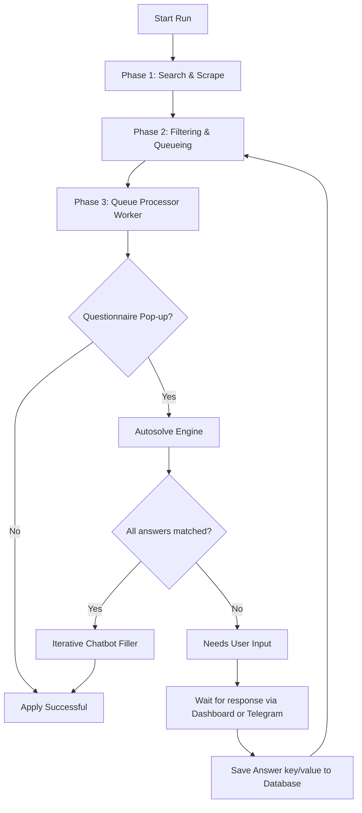

# Naukri Bot System Workflow

This document explains the end-to-end operational flow of the Naukri Job Automation Bot at a high and basic level.

---

## High-Level Flow Chart

---

## Detailed Step-by-Step Execution

### 1. Phase 1: Search & Scrape
Whenever the scheduler daemon wakes up (configured weekdays at `10:30 AM` / `01:00 PM`) or you trigger `npm run run-now`:
* The bot opens Playwright in a headful/headless Chromium instance loaded with your authenticated Naukri session cookies.
* It iterates through your configured **Keywords**, **Locations**, and **Experience levels** in `.env`.
* It opens the Naukri job list search page (sorted by freshness) and extracts the standard details of raw search results (job title, company name, URL, location details, first index date).

### 2. Phase 2: Filtering & Queueing
To avoid applying to irrelevant roles:
* **Keyword Matching:** The scraper verifies the job title matches one of your configured target keywords (e.g. "React Developer" fits custom filters, whereas "Sales Engineer" is ignored).
* **Experience Matching:** Checked against your year ranges.
* **Redundancy Filter:** Queries the SQLite DB (`data/naukri.db`) to ensure you haven't applied to this identical job post URL or company position details previously.
* If all filtering checks pass, the job and application is saved in the database with status `QUEUED`.

### 3. Phase 3: Application worker (The Queue Solver)
Once searching is finished, the application processor loops through all jobs in the database with status `QUEUED`:
1. It opens the job details URL.
2. It clicks the "Apply" button.
3. If the button submits immediately with no questions (classic apply), the bot marks it as `APPLIED`.
4. If a questionnaire dialog or step-by-step chatbot pops up, it invokes the **Autosolve & Conversational Loop**:
   - **Step Scan:** Scrapes the currently visible question text in the chatbot overlay, excluding global elements like search boxes.
   - **Solve Strategy:** Compares the question with your `.env` profile data (notice period, current salary, expected salary, total experience) and previously solved answers saved in the SQLite `answers` dictionary.
   - **Form Entry:** Fills the input, select dropdown, or radio choice dynamically and fires DOM change events.
   - **Send Action:** Simulates a click on "Send"/"Next/Continue" or presses the native `Enter` key inside the text field.
   - **Repeat:** Runs step 1-4 iteratively up to 8 times until the dialog closes.
   - **Suspend on Unknown:** If it hits an unknown question it cannot answer itself, it marks the application as `NEEDS_USER_INPUT`, logs the query, sends an alert, and safely moves to the next job.

### 4. Phase 4: Manual Correction Loop
When an application requires manual input, you are notified through:
* **The Web Dashboard:** Go to `http://localhost:3000`, click the **"Needs Input"** tab, type answers into the question forms, and click **"Submit Answers & Queue"**.
* **Telegram Messaging:** Read the alert showing the questions. Reply in your Telegram chat using standard command formats: `/answer <applicationId> value1 | value2`.

Once submitted, the answers are added to the dictionary `answers` table so the bot remembers it moving forward, and sets the job status back to `QUEUED` to resume processing.
